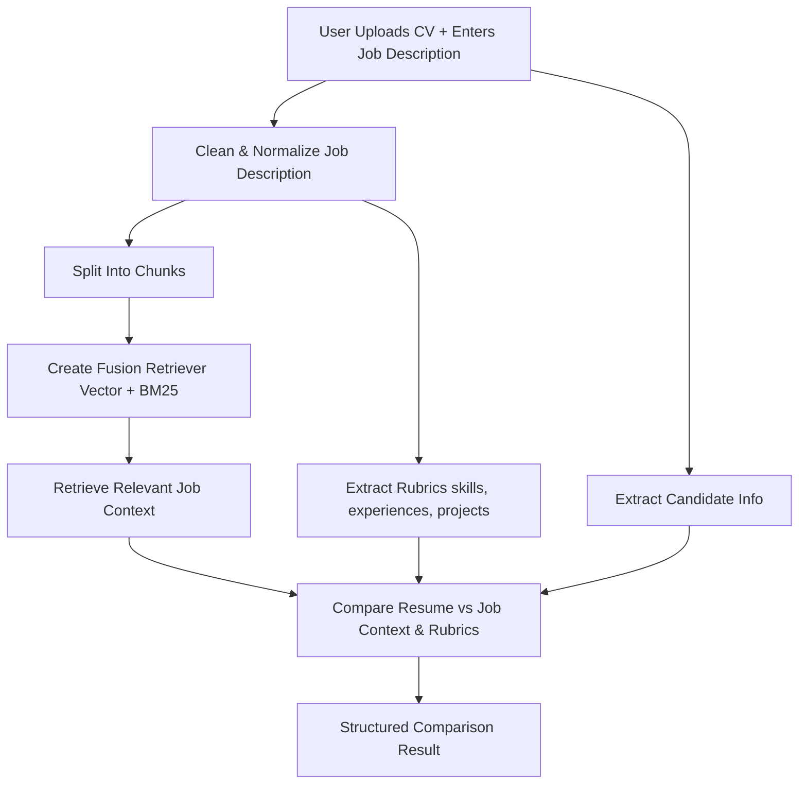

# Resume Evaluation with LLM

A Streamlit application that evaluates a candidate's resume against a provided job description using Large Language Models (LLMs) and a hybrid retrieval strategy (Vector Store + BM25 via Query Fusion).

## 🔍 Core Idea

Given a CV (PDF) and a job description, the app:

1. Extracts structured candidate information from the resume.
2. Cleans and normalizes the job description text.
3. Splits the job description into semantic chunks.
4. Uses a Query Fusion Retriever (vector embeddings + BM25) to surface the most relevant job context.
5. Compares the candidate profile against extracted rubrics (skills, experiences, projects) and contextualized job needs.
6. Produces a structured comparison result you can use for match scoring or feedback.

## 🧪 Why Vector + BM25 (Query Fusion)?

The fusion approach balances semantic recall and lexical precision:

- **Vector Store (Embeddings)**: Captures semantic similarity beyond exact keyword matches, helpful for paraphrased requirements.
- **BM25**: Excels at exact term matching and is computationally efficient.
- **Reciprocal Rank Fusion (RRF)**: Combines ranked results from both retrievers to improve robustness across varied queries.

This hybrid improves ranking stability and reduces blind spots when either semantic or lexical methods alone would underperform.

## 🛠 Tech Stack

- **Streamlit** for the UI.
- **LlamaIndex** for document parsing, chunking, and retrieval orchestration.
- **ChromaDB** as persistent vector store.
- **BM25Retriever** (LlamaIndex) with stemming (English) for term-based scoring.
- **QueryFusionRetriever** (RRF mode) to merge BM25 + vector results.
- **Custom LLM prompts** for rubric extraction and comparison.

## 📂 Project Structure

```
app.py                        # Streamlit entrypoint
module/
  collection.py               # Retrieval (vector, BM25, fusion) + generic retrieve()
  config.py                   # (Config settings - if used)
  embedding_agent.py          # Embedding model factory (HuggingFace)
  llm_agent.py                # LLM factory (Gemini or other)
  load_document.py            # PDF and job description loaders & cleaners
  prompt_template.py          # Prompt templates for extraction & comparison
  splitter.py                 # Chunking logic for job description text
requirements.txt              # Python dependencies
```

## 🔄 Processing Flow



## ⚙️ Retrieval Strategy Details

Implemented in `module/collection.py`:

- Build a `VectorStoreIndex` backed by ChromaDB (`create_vector_store_index`).
- Build a `BM25Retriever` over sentence-split nodes (`create_bm25_retriever`).
- Combine both via `QueryFusionRetriever` in RRF mode (`create_query_fusion_retriever`).
- Unified `retrieve()` wrapper dispatches based on retriever/index type.

Key parameters:

- `similarity_top_k=3` for focused context.
- `num_queries=3` (fusion expansion) to improve recall diversity.
- English stemming (Porter-like via `Stemmer`).

## ✅ Features

- PDF resume ingestion.
- Structured candidate extraction.
- Automatic rubric extraction from job description.
- Hybrid retrieval for contextual relevance.
- Comparison output (JSON) ready for downstream scoring.
- Stepwise status updates + spinner in UI during evaluation.

## 🚀 Getting Started

### 1. Install Dependencies

```bash
pip install -r requirements.txt
```

### 2. Run the App

```bash
streamlit run app.py
```

### 3. Use It

1. Upload a PDF resume.
2. Paste the job description text.
3. Click "Evaluate Resume".
4. Wait for the spinner while processing runs.
5. Inspect: Rubrics, Job Context, Comparison Result.

## 🧩 Configuration & Customization

- Adjust chunking in `splitter.py` (`chunk_size`, `chunk_overlap`).
- Change `top_k` or fusion parameters in `create_query_fusion_retriever`.
- Swap embedding model in `embedding_agent.py`.
- Modify prompt templates in `prompt_template.py` for different extraction styles.
- Replace or extend LLM provider in `llm_agent.py`.

## 📊 Evaluation Logic

The comparison step aligns resume-derived entities (skills, experiences, projects) against:

- Extracted rubrics from job description (LLM-generated canonical set).
- Retrieved contextual snippets (vector + lexical fusion outcome).

You can introduce a scoring function (e.g., Jaccard similarity, weighted coverage) atop the comparison JSON to derive a numeric match rate.

## 🔧 Extensibility Ideas

- Add scoring metrics & visual gauges.
- Support multiple resumes (batch compare).
- Persist evaluations with IDs (SQLite / Postgres).
- Add caching for embeddings and rubric extraction.
- Enable multi-language stemming & embeddings.
- Integrate more retrievers (e.g., sparse embedding models).
- Provide API endpoints (FastAPI) for headless usage.

## 🛡 Notes on Reliability

- BM25 ensures exact keyword presence isn't missed.
- Embeddings mitigate vocabulary mismatch (synonyms, paraphrases).
- Fusion (RRF) avoids over-reliance on any single retrieval modality.

## 🗑 Cleanup

Temporary file `temp_cv.pdf` is written per upload. Consider deleting it post-processing or using an in-memory buffer for stricter hygiene.

## 📜 License

This project is licensed under the **MIT License** – see the [`LICENSE`](./LICENSE) file for details.

You are free to:

- Use, copy, and modify
- Distribute and sublicense
- Include in commercial products

Provided that you include the original copyright notice and license text.

If you contribute, you agree your contributions will be licensed under the same MIT terms.

## 🤝 Contributing

Issues & PRs welcome. Suggested areas: scoring module, multilingual support, UI enhancements.

---

Feel free to ask for a scoring implementation or an API wrapper next.
